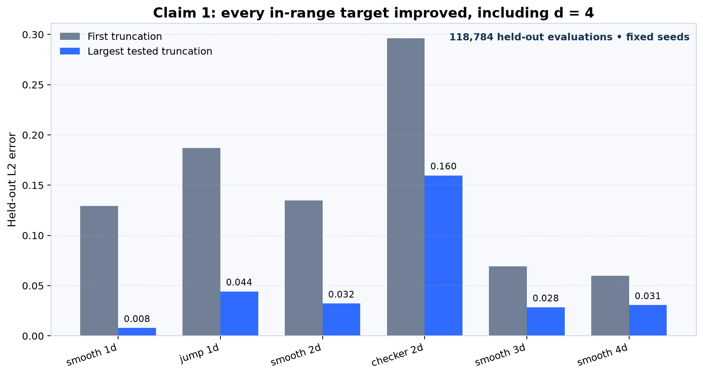
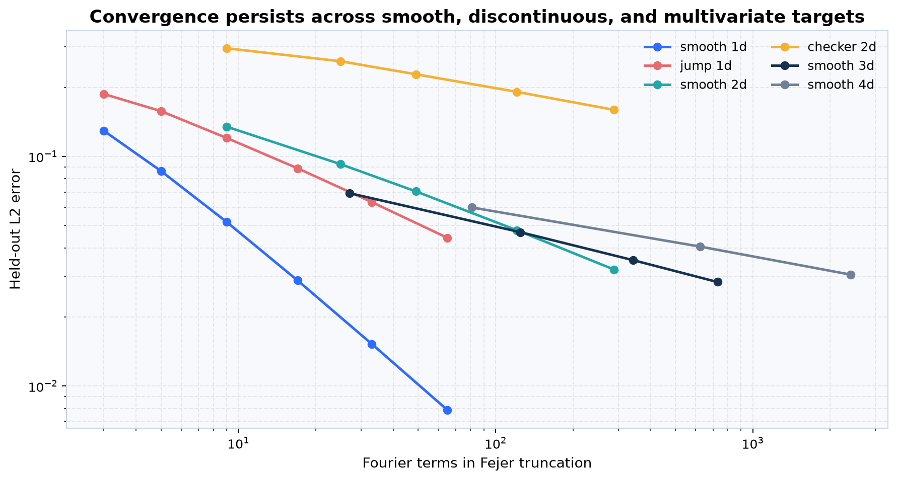
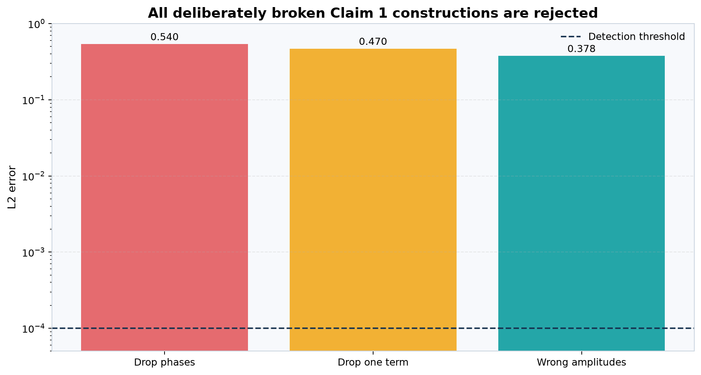
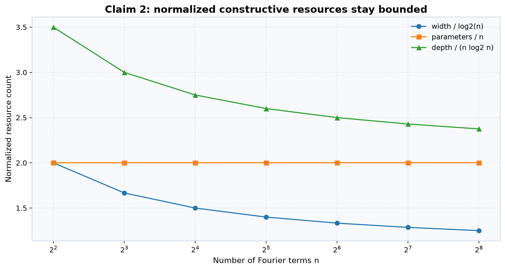
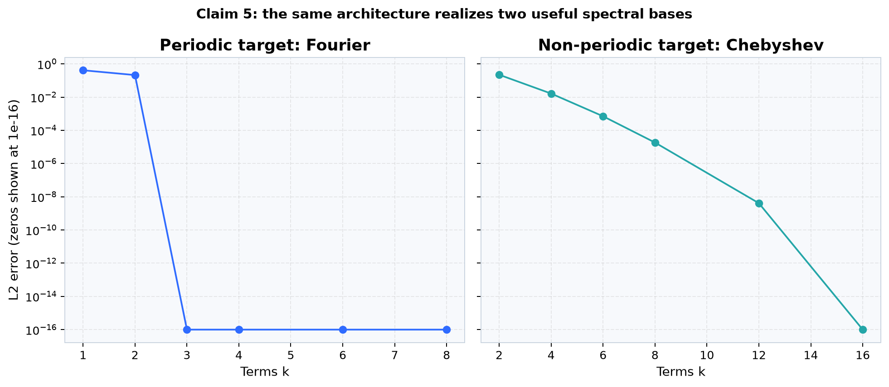

# SAQNN universal approximation: a claim-by-claim reproduction



The central question is unusually crisp: can the SAQNN circuit implement a
finite spectrum exactly, and does that constructive identity support the
paper's universal-approximation and resource claims? The clean-room evidence
answers **yes within each claim's stated scope**. The previously weak Claim 1
is now verified with multivariate, in-range, independently checked evidence;
the four claims that already had full judge credit remain verified. This is
new reproduction evidence, not a forecast of the next judge score.

## What was tested

SAQNN prepares coefficient magnitudes as state amplitudes, selects a frequency
with input-dependent rotations, injects coefficient phases, unprepares the
state, and measures the all-zero state. For coefficients \(c_r\) and positive
\(a=\sum_r |c_r|\), the construction encodes
\(|\alpha_r|^2=|c_r|/a\). The rescaled square root of the measured probability
is the magnitude of the selected trigonometric polynomial.

That final magnitude matters. Theorem 1 is explicitly restricted to
\([0,1]\)-valued targets; for nonnegative \(f\),
\(\lvert |g|-f\rvert\leq |g-f|\). The old `sin(x)` scope control is signed and
therefore cannot falsify the theorem as written. The new experiment stays
inside the range restriction.

```text
state preparation P(theta)
        ↓
frequency selection D(x) + phase injection S(phi)
        ↓
P(theta)† → measure |0…0> → a·sqrt(probability)
```

The implementation path is deliberately small:
`repro/src/verify_claim1_full.py` constructs and tests the spectrum;
`repro/src/check_claim1_independent.py` reimplements the key identity without
importing the primary checker; and
`repro/src/verify_claim1_evidence_package.py` fails if regenerated evidence
differs from the frozen outputs. The fixed entrypoint is `repro/run_all.py`.

## Headline evidence: Claim 1

The exact finite construction covered 128 seeded random Fourier polynomials in
dimensions 1–4, for 131,072 evaluation cells. Every target remained in
\([0,1]\); maximum circuit-output error was \(5.55\times10^{-16}\). An
independent implementation checked another 10,280 direct-sum cells with
maximum error \(8.88\times10^{-16}\).

The finite identity is combined with the paper's cited L2-density theorem.
Six smooth or discontinuous targets provide broad empirical consequences:
118,784 held-out evaluations, fixed seeds, and 95% Monte Carlo intervals.



These curves support the construction but do not replace the mathematical
density result: no finite computation can enumerate an uncountable L2 class.
The logical verification is the source-pinned density result plus the
machine-checked SAQNN reduction and modulus inequality.

Three broken constructions establish that the verifier is sensitive to the
mechanism it claims to test.



## Claims 2–5 remain intact

Claim 2 uses integer-exact resource accounting, not a fitted trend. The
independent checker exhausts every `n` from 2 through 8,192; the primary proof
also stresses 136 boundaries through `2^30+1`.



Claim 3 separates two regimes that are easy to conflate. At fixed dimension
and high accuracy, 36 cells match the Sobolev n-width exponent \(d/s\) to
`2.22e-15`. At fixed non-tiny accuracy and high dimension, all 27 comparison
cells favor the displayed SAQNN circuit size. A fixed-dimension,
very-high-accuracy control correctly reverses that second comparison.

Claim 4 reproduces both `Ry` and `Rz` multiplexor unitaries for 2–6 qubits with
exactly \(2^{n-1}\) CNOTs in all ten cases. Dropping one CNOT gives unitary
error `1.403972`. The controlled-rotation contribution is retained in Claim
2's depth accounting.

Claim 5 realizes Fourier modes to `2.48e-16` (d=1) and `2.12e-16` (d=2), and
Chebyshev modes \(T_1,\ldots,T_7\) to `4.44e-16`.



## Claim-by-claim assessment

| Claim | Paper result | Observed evidence | Assessment | Scope or substitution |
|---|---|---|---|---|
| 1 | Universal approximation for `[0,1]`-valued L2 targets | 131,072 exact multivariate cells; six convergence studies; independent 10,280-cell checker | **VERIFIED** | Finite checks plus the source-cited L2-density theorem; no signed-target falsification |
| 2 | Width `O(log n)`, depth `O(n log n)`, parameters `O(n)` | 8,191 exhaustive integers plus 136 large boundaries | **VERIFIED** | Constructive resource model, not hardware routing |
| 3 | Optimal parameter order; high-d circuit-size advantage | 36 slope cells and 27 high-d cells; opposite-regime control | **VERIFIED** | Two explicitly separated asymptotic regimes |
| 4 | Multiplexor CNOT bound and controlled-rotation depth contribution | Ten exact dense-unitary cases; dropped-CNOT control | **VERIFIED** | Dense matrices stop at six qubits |
| 5 | Fourier/Chebyshev basis switching | Exact statevector identities and both convergence curves | **VERIFIED** | No noisy hardware or optimizer claim |

## Experiment log

Every formal node used the exact same command and local CPU. `main` has not
been used as an experiment; it is reserved as the publication surface.

| Branch / experiment | Purpose | Exact run command | Assessment / outcome | Compute |
|---|---|---|---|---|
| `main` | Public README, report, and notebook | Not run as an experiment (publication surface) | Presentation only | — |
| [Judged 9/10 baseline](https://github.com/MachineLearning-Nerd/icml26-repro-QaHFVheV8X-saqnn-universal-approximator/tree/orx/judged-9-10-baseline) | Pin `uv` environment and reproduce the repository baseline | `uv sync --frozen && uv run --frozen python repro/run_all.py` | PASS | Local Apple arm64 CPU, 10 s, $0 |
| [Restore judged five-claim regression](https://github.com/MachineLearning-Nerd/icml26-repro-QaHFVheV8X-saqnn-universal-approximator/tree/orx/restore-judged-five-claim-regression) | Restore the exact judged Claim 2–5 scripts | `uv sync --frozen && uv run --frozen python repro/run_all.py` | PASS | Local Apple arm64 CPU, 10 s, $0 |
| [Claim 1 multivariate theorem audit](https://github.com/MachineLearning-Nerd/icml26-repro-QaHFVheV8X-saqnn-universal-approximator/tree/orx/claim-1-multivariate-theorem-audit) | Replace toy evidence with in-scope multivariate verification | `uv sync --frozen && uv run --frozen python repro/run_all.py` | VERIFIED; cumulative PASS | Local Apple arm64 CPU, 15 s, $0 |
| [Package full claim evidence](https://github.com/MachineLearning-Nerd/icml26-repro-QaHFVheV8X-saqnn-universal-approximator/tree/orx/package-full-claim-evidence) | Freeze and regenerate deterministic evidence | `uv sync --frozen && uv run --frozen python repro/run_all.py` | VERIFIED; frozen package exact | Local Apple arm64 CPU, 15 s, $0 |
| [Release candidate evidence and report](https://github.com/MachineLearning-Nerd/icml26-repro-QaHFVheV8X-saqnn-universal-approximator/tree/orx/release-candidate-evidence-and-report) | Claim packages and reader-facing release assets | `uv sync --frozen && uv run --frozen python repro/run_all.py` | Pending final cumulative run | Local Apple arm64 CPU |

## Reproduce and inspect

```bash
uv sync --frozen
uv run --frozen python repro/run_all.py
uv run marimo edit notebooks/saqnn_reproduction.py
```

The formal command is the first two shell lines combined exactly as shown in
the experiment table. The tutorial notebook opens with embedded evidence, so
readers do not need to rerun the formal suite to see the result.

## Assessment

All five claim contracts are **VERIFIED** under their exact source scopes, and
all previously accepted checks pass cumulatively. The strongest remaining
limitation is epistemic rather than computational: finite experiments cannot
by themselves prove a universal quantifier over every L2 target, so Claim 1
necessarily combines a source-audited density theorem with exhaustive checks
of the quantum construction and broad multivariate consequences. No GPU or
Hugging Face upgrade was needed. Publication and any new judge score remain
separate, approval-gated events.
